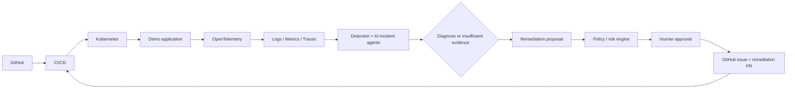

# AI-Native DevOps & SRE Platform

A production-oriented reference implementation of an **AI-native DevOps/SRE control loop**: a demo
workload is instrumented end to end (logs, metrics, traces), degradation is detected against learned
baselines, an evidence-bounded AI agent diagnoses the likely cause, remediation is proposed, gated by an
explicit policy engine plus human approval, and finally applied as an auditable GitHub pull request. An
LLM never mutates production directly.

The repository optimizes for **verifiable engineering quality** over size: committed lockfiles, CI gates
that run the same commands a developer can run locally, deterministic test fixtures, and an audit trail
for every agent decision.

## Control loop



## Delivery status

The platform is built incrementally. This table tracks the phases defined in
[`AI_Native_DevOps_SRE_DataFactor_Agentic_Task_List.md`](AI_Native_DevOps_SRE_DataFactor_Agentic_Task_List.md).

| Phase | Scope | Status |
| --- | --- | --- |
| 0 (Task 0.1) | Repository governance | Implemented |
| 0 (Tasks 0.2-0.3) | Tooling standards, reproducible dependencies | Planned |
| 1 | Architecture, ADRs, versioned contracts | Planned |
| 2 | Demo production application (FastAPI + Next.js + containers) | Planned |
| 3-4 | Kubernetes platform, Terraform infrastructure | Planned |
| 5-7 | OpenTelemetry, Prometheus/Grafana, SLO/incident model | Planned |
| 8-12 | AI agent runtime, remediation, governance/audit | Planned |
| 13-19 | Database, queue/worker, testing tiers, CI/CD, runbooks, DR | Planned |
| 20-26 | Documentation, threat model, performance, evaluation, e2e demo | Planned |

## Quick start

Prerequisites (exact versions and pinning locations are documented in
[docs/03-local-development.md](docs/03-local-development.md)):

- Python 3.11 or newer
- Node.js 20.19 or newer (demo frontend and repository tooling)
- [`uv`](https://docs.astral.sh/uv/) for reproducible Python dependency resolution

```bash
git clone https://github.com/Kaoserahamed/AI-Native-DevOps-SRE-Platform.git
cd AI-Native-DevOps-SRE-Platform
python -m pip install uv
uv sync --frozen --all-extras
uv run pre-commit install
npm ci
```

Every gate CI runs on a pull request is available locally through one command:

```bash
make verify            # repository policy, format, lint, typecheck, fast tests, frontend tooling
make test-integration  # ephemeral PostgreSQL/Redis/OTel tiers
```

Windows has no `make` by default; [docs/03-local-development.md](docs/03-local-development.md) lists the
equivalent commands, including the Node tooling fallback for clone paths that contain `&`.

## Repository layout

```text
apps/demo-app/       Demo workload: FastAPI backend, Next.js frontend, its own tests
services/            Platform services: api, incident-agent, anomaly-agent, remediation-agent, worker
packages/            Shared libraries: contracts, observability, github_client, kubernetes_client,
                     llm, policy, test_fixtures
infra/kubernetes/    Kustomize base, environment overlays, policies, manifest tests
infra/terraform/     Reusable modules, environment roots, IaC tests
observability/       OpenTelemetry collector, Prometheus rules, Grafana dashboards, alert definitions
docs/                Architecture, ADRs, runbooks, SLOs, threat model, governance
scripts/             Local + CI helper scripts (repository policy checks, load generation)
tests/               Cross-cutting contract, integration, e2e, chaos suites and fixtures
```

## Documentation

Repository-wide governance documents are available now; the architecture, API, observability, security
and operations documents are added by the phase that implements them, and are linked here once they
exist (`docs/00-overview.md`, `docs/01-architecture.md`, `docs/03-local-development.md`,
`docs/04-configuration.md`, `docs/05-api.md`, `docs/06-data-model.md`, `docs/07-observability.md`,
`docs/08-ai-agents.md`, `docs/09-incident-lifecycle.md`, `docs/10-security.md`,
`docs/11-threat-model.md`, `docs/12-kubernetes.md`, `docs/13-terraform.md`, `docs/14-ci-cd.md`,
`docs/15-testing-strategy.md`, `docs/16-sre-slos.md`, `docs/17-cost-optimization.md`,
`docs/19-disaster-recovery.md`, `docs/20-runbooks/`, `docs/adr/`).

| Document | Purpose |
| --- | --- |
| [docs/03-local-development.md](docs/03-local-development.md) | Supported runtimes, tooling pins, canonical commands |
| [docs/18-governance.md](docs/18-governance.md) | Branch protection, review and change policy |
| [CONTRIBUTING.md](CONTRIBUTING.md) | How to propose and validate changes |
| [SECURITY.md](SECURITY.md) | Vulnerability reporting and security expectations |
| [CODE_OF_CONDUCT.md](CODE_OF_CONDUCT.md) | Community expectations and enforcement |
| [CHANGELOG.md](CHANGELOG.md) | Release history |

## Security and agent safety model

- Telemetry, logs and GitHub content are treated as **untrusted input**; they are never allowed to
  redefine agent policy.
- Agent tools are allowlisted, read-only by default, and fully audited.
- Production mutation requires a policy pass **and** an explicit, expiring human approval; approvals are
  bound to an action hash so a replayed approval cannot authorize a changed action.
- Secrets, Terraform state, kubeconfigs and `.env` files are never committed; CI enforces this.

See `docs/10-security.md` and `docs/11-threat-model.md` for the full model once those documents land.

## License

Apache License 2.0 — see [LICENSE](LICENSE).
