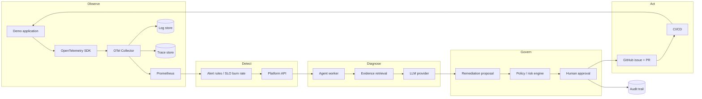

# Overview

## What this platform is

An AI-native DevOps/SRE platform that closes the operational loop end to end: it observes a real
workload, detects degradation against a learned baseline, gathers **bounded** evidence, asks an LLM for a
structured diagnosis, turns that diagnosis into a governed remediation proposal, requires an explicit
human approval, and finally applies the change through GitHub — with an audit record for every step.

It is a reference implementation, not a product: the code, the infrastructure, the tests and the
operational documentation are all in this repository so that the whole control loop can be reproduced
from a fresh clone.

## Why it exists

Most "AIOps" demonstrations stop at a dashboard or a chatbot. The engineering problem is not calling an
LLM; it is making an automated operator **trustworthy**:

| Problem | How this platform addresses it |
| --- | --- |
| Models hallucinate plausible causes | Diagnosis must cite retrieved evidence; an explicit `insufficient_evidence` outcome is a valid result |
| Automated remediation is dangerous | Proposals are policy-checked, blast-radius bounded and require expiring human approval bound to an action hash |
| Silent automation failures | Every invocation records agent/prompt/model versions, evidence IDs, decision, confidence, policy result and outcome |
| Untrusted telemetry as an attack path | Logs, metrics and GitHub content are data, never instructions; tools are allowlisted and read-only by default |
| Unverifiable claims | Every capability ships with tests and a CI gate; lockfiles, manifests and infrastructure are validated in the pipeline |

## Non-goals

- Training or hosting models: the platform calls provider APIs behind an abstraction.
- Replacing an on-call engineer: it produces evidence-backed diagnoses and proposals, never unattended
  production changes.
- Being a general-purpose monitoring product: observability is implemented with standard OpenTelemetry,
  Prometheus and Grafana components.
- Multi-tenant SaaS: a single platform instance manages the demo workload and its own infrastructure.

## Control loop

## Engineering principles

1. **Evidence before inference.** The agent retrieves a bounded, time-windowed evidence set; anything it
   cannot cite is not part of the diagnosis.
2. **Human authority over production.** Policy can only ever *reduce* what is allowed; it never grants
   autonomy. Every production-changing action carries an approval record.
3. **Deterministic tests, real integration only where it matters.** Unit and contract tests use fakes and
   fixtures; PostgreSQL, Redis, the collector and Kubernetes are exercised in dedicated integration/e2e
   jobs.
4. **Reproducible by construction.** One Python lockfile, one npm lockfile, SHA-pinned actions, committed
   Terraform lockfile, immutable image references.
5. **Small cohesive modules over god files.** Interfaces and adapters isolate external systems (GitHub,
   Kubernetes, Prometheus, PostgreSQL, Redis, LLM providers).
6. **Operable by default.** Metrics, structured logs, traces and correlation IDs on every critical path,
   plus runbooks and SLOs for the platform itself.

## Audience

| Reader | Start here |
| --- | --- |
| Reviewer evaluating engineering depth | [01-architecture.md](01-architecture.md), then `docs/adr/`, then the CI workflows |
| Developer joining the project | [03-local-development.md](03-local-development.md), then [CONTRIBUTING.md](../CONTRIBUTING.md) |
| SRE/operator | `docs/16-sre-slos.md`, `docs/20-runbooks/`, `docs/19-disaster-recovery.md` |
| Security reviewer | `docs/10-security.md`, `docs/11-threat-model.md`, [SECURITY.md](../SECURITY.md) |

## Glossary

| Term | Meaning |
| --- | --- |
| Incident | A tracked degradation of a service with severity, evidence, diagnosis, actions and resolution |
| Evidence | A bounded, time-windowed observation (metric series, log excerpt, trace summary, Kubernetes state, deployment event) referenced by ID |
| Proposal | A remediation candidate with rationale, evidence, expected impact, blast radius, rollback plan and confidence |
| Approval | A human decision bound to a specific action hash, with an expiry and an approver identity |
| Action hash | Canonical digest of a proposed action (target, parameters, image/manifest revision) that approvals and idempotency keys bind to |
| Control plane | The platform components that decide and act (API, agents, policy, approvals, audit) |
| Data plane | The observed workload and its telemetry pipeline (demo app, collector, Prometheus, Grafana, stores) |
