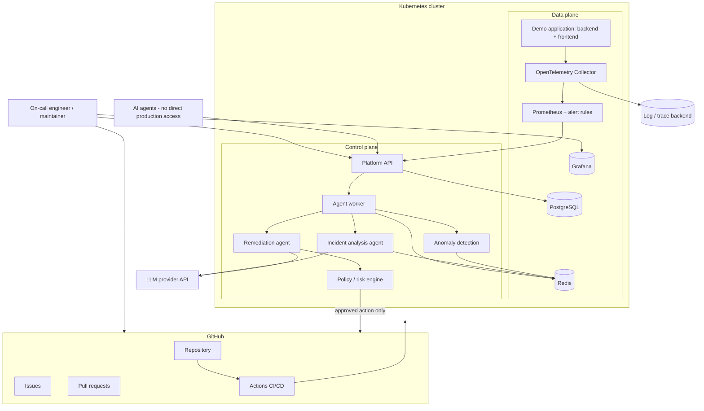
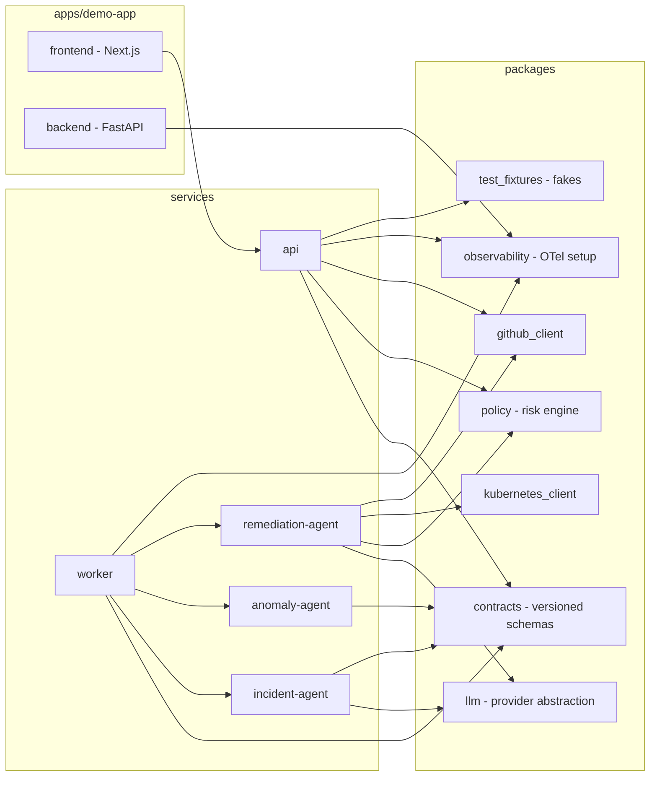

# Architecture

This document defines the platform architecture: context, components, responsibilities, trust
boundaries, interaction styles and failure domains. It is the reference used by the ADRs in
[docs/adr/](adr/) and by the security documentation.

Diagrams are written as Mermaid inside this repository rather than as exported images, so they cannot go
stale silently: a diagram change is a reviewable text change in the same pull request as the code.

## 1. System context

Responsibilities at the boundary:

- **GitHub** is the system of record for code, reviewed change (issues/PRs) and deployment execution
  (Actions). Nothing reaches the cluster except through a pipeline run.
- **Kubernetes** hosts both planes. The control plane runs with least-privilege service accounts and
  cannot mutate workloads without an approved action.
- **LLM providers** are stateless text/reasoning services on the far side of a provider abstraction; they
  receive bounded evidence, never credentials, and never hold authority.

## 2. Components

Component responsibilities:

| Component | Responsibility | Talks to |
| --- | --- | --- |
| `apps/demo-app/backend` | Observable FastAPI workload: health, readiness, metrics, structured logs, correlation IDs, PostgreSQL and Redis usage, one controllable fault behind a test-only flag | PostgreSQL, Redis, OTel collector |
| `apps/demo-app/frontend` | Typed operator view of health/status and correlation IDs | Platform API, backend |
| `services/api` | Platform HTTP API: incidents, lifecycle transitions, evidence lookup, proposals, approvals, audit queries; validates every payload against `packages/contracts` | PostgreSQL, Redis, policy, GitHub |
| `services/worker` | Consumes queue jobs, enforces retries/backoff/dead-lettering, runs agents under budgets, emits worker metrics | Redis, agents, PostgreSQL |
| `services/anomaly-agent` | Deterministic anomaly detection: rolling baselines, threshold deviation, rate of change, deduplication, correlation windows | Redis, contracts |
| `services/incident-agent` | Evidence retrieval, correlation and LLM diagnosis with citations, confidence and `insufficient_evidence` handling | LLM, evidence adapters, contracts |
| `services/remediation-agent` | Builds remediation proposals, runs policy checks, prepares patches and PR payloads for approved actions | LLM, policy, Kubernetes, GitHub |
| `packages/contracts` | Versioned schemas: incident, alert, evidence, agent decision, remediation proposal, approval, audit event, API error | - |
| `packages/observability` | One OTel bootstrap used by every service (resources, exporters, propagation, log correlation) | OTel collector |
| `packages/github_client` | Least-privilege GitHub adapter: repo metadata, commits, deployments, issues, PRs, checks | GitHub API |
| `packages/kubernetes_client` | Read-mostly cluster inspection adapter (pods, events, rollouts, resource usage) | Kubernetes API |
| `packages/llm` | Provider-agnostic LLM interface: timeouts, retries, rate limits, structured output, token/cost accounting, fallback policy | LLM providers |
| `packages/policy` | Deny-by-default action policy: allowed categories, blocked namespaces/resources, scope limits, rate limits, maintenance windows, approval requirements | - |
| `packages/test_fixtures` | Deterministic fakes and sanitized incident fixtures shared by unit/contract/agent tests | - |

## 3. Control plane versus data plane

| Aspect | Control plane | Data plane |
| --- | --- | --- |
| Responsibility | Detect, diagnose, propose, govern, act, audit | Serve traffic and produce telemetry |
| Components | `api`, `worker`, anomaly/incident/remediation agents, policy engine, PostgreSQL (platform state), Redis (queue) | Demo backend and frontend, OTel collector, Prometheus, Grafana, log/trace backend, application databases |
| Change rate | Application code ships weekly; prompts, policy and configuration are versioned in git | Every request; deployments only through the approved pipeline |
| Failure impact | Automation degrades; humans keep operating from dashboards and runbooks | Customer-visible: availability, latency and error SLOs |
| Access model | Least-privilege service accounts, read-only Kubernetes by default, GitHub write limited to issues and pull requests | Workload service accounts with no cluster-wide permissions |
| SLOs | Agent success rate, detection-to-incident latency, approval latency, evidence retrieval success | Availability, latency, 5xx rate, saturation |
| Scaling | Queue-driven workers, autoscaling on queue depth and processing latency | Autoscaling on CPU/latency, pod disruption budgets, explicit requests and limits |

**Design rule:** the control plane may *read* data-plane state freely, but may only *change* the data
plane through a policy-approved action executed by the pipeline.

## 4. Trust boundaries

| ID | Boundary | Direction | Controls |
| --- | --- | --- | --- |
| TB-1 | Internet → ingress | Operator/browser traffic in | TLS, ingress rate limits, authentication and authorization for mutating endpoints, request size limits |
| TB-2 | Telemetry → control plane | Log lines, metric labels and trace attributes in (attacker-influenceable) | Evidence treated strictly as data, bounded windows and sizes, sanitisation before rendering, structured-output validation |
| TB-3 | GitHub → control plane | Issue, PR and comment bodies plus repository metadata in | Untrusted input handling, no tool or policy redefinition from content, least-privilege token scopes |
| TB-4 | LLM provider ↔ control plane | Prompts out, completions in | Provider abstraction, schema validation of completions, no secrets in prompts, budgets, policy checks regardless of model output |
| TB-5 | Control plane → Kubernetes workload | Approved action execution | Deny-by-default policy, allowlisted namespaces and resources, action hash plus approval, audit record, agents hold no direct write credentials |
| TB-6 | CI/CD → environments | Build artifacts in | Trusted branches only, SHA-pinned actions, immutable image references, environment protection with reviewers |
| TB-7 | Platform → platform databases | Incident, approval and audit state | Separate credentials per service, least privilege, reviewed migrations, tested backups and restore |

Every boundary crossing produces an audit event with actor, timestamp, correlation ID and before/after
state.

## 5. Synchronous versus asynchronous interactions

| Interaction | Style | Protocol | Timeout and retry | Idempotency |
| --- | --- | --- | --- | --- |
| Incident lifecycle mutations (API) | Sync | HTTPS/JSON | Per-request timeout, no blind client retries | State machine with optimistic concurrency; invalid transitions rejected |
| Evidence and audit queries (API) | Sync | HTTPS/JSON | Paginated with bounded time windows | Read-only |
| API → PostgreSQL | Sync | TCP (psycopg) | Connection pool, statement timeout | Transactions plus idempotency keys for mutations |
| API → Redis (enqueue) | Async producer | RESP | Fail fast; an enqueue failure is surfaced, never swallowed | Job key derived from incident and action hash |
| Worker ← Redis | Async consumer | RESP | Visibility timeout, retry with backoff, dead-letter queue | Same idempotency key, so replays are safe |
| Worker → agents | In-process call | Python | Per-agent wall-clock timeout plus iteration, token and cost budgets | Runs are recorded; repeated runs are compared rather than merged |
| Agent → LLM provider | Sync with retry | HTTPS/JSON | Timeout, exponential backoff with jitter, rate-limit handling, fallback provider | Deterministic fixtures in tests; live calls only in evaluation runs |
| Agent → Prometheus, Kubernetes, GitHub, telemetry backends | Sync reads | HTTPS/JSON | Timeouts, bounded result sizes, retries only for idempotent reads | Read-only |
| Control plane → GitHub (issue/PR) | Sync write | HTTPS/JSON | Timeout plus retry with a dedup marker | Deterministic branch name and marker comment: duplicates are updated, not re-created |
| Control plane → CI/CD → cluster | Async, pipeline-driven | GitHub Actions plus kubectl/kustomize | Pipeline retries under its own policy | Immutable image tag or digest per action |

**Rule of thumb:** reads are synchronous and bounded, while state changes travel through the queue so a
slow LLM or an unavailable provider degrades throughput instead of blocking the API.

## 6. Failure domains

| Failure | Blast radius | Detection | Mitigation and degradation |
| --- | --- | --- | --- |
| PostgreSQL unavailable | Incident state, approvals and audit writes fail; API returns 5xx | API 5xx rate, database saturation alerts | Connection pooling, jittered read retries, read-only degradation where possible, restore runbook |
| Redis unavailable | Queueing stops, so no new agent work; reads continue to be served | Queue-depth alerts, worker health endpoint | Backpressure, dead-letter handling, in-flight jobs re-enqueued from database state after recovery |
| OTel collector down | Missing telemetry and detection blind spots | Collector metrics, absent-series alerts | SDK buffering, collector redundancy, explicit "telemetry missing" outcome instead of guessing |
| Prometheus unavailable | Alerts and SLO evaluation stop | Prometheus self-metrics | Restarts with retained data, alerting on absent data, documented runbook |
| LLM provider outage or throttling | Diagnoses and proposals delayed | Provider error-rate and latency metrics | Fallback provider policy, bounded retries, incident stays `investigating` with evidence attached |
| GitHub API outage | Issues and pull requests cannot be created or updated | Adapter error metrics | Retry with backoff and dedup markers, documented manual fallback in the runbook |
| Agent produces a wrong diagnosis | A misleading proposal reaches review | Approval gate, evidence citations, evaluation suite | Human approval, policy limits, uncertainty reported in the proposal, rejected proposals feed the evaluation set |
| Bad deployment | Data-plane degradation | SLO burn-rate and error-rate alerts | Automated detection, rollback proposal, human-approved rollback, post-rollback verification |
| Worker crash | Job is delayed, not lost | Visibility timeout and worker liveness | Job returns to the queue; poison jobs land in the dead-letter queue with the failure reason |
| Node or cluster loss | Data-plane and control-plane pods are evicted | Kubernetes and node alerts | Multiple replicas, pod disruption budgets, rescheduling, DR rebuild procedure |
| Compromised agent tool | Unauthorized reads or a malicious proposal | Audit trail, tool-usage anomaly detection | Least-privilege tools, allowlists, approval requirement, credential rotation runbook |

Failure domains are exercised by the chaos test tier, and the expected behaviour of each test must be
documented before the test is enabled.

## 7. Keeping this document honest

- Diagram and table changes ship in the same pull request as the behaviour they describe.
- A change to a trust boundary requires an ADR, a threat-model update and security-owner review.
- The end-to-end incident demonstration is the executable proof that this architecture behaves as
  documented; it runs in CI (`docs/15-testing-strategy.md`).
